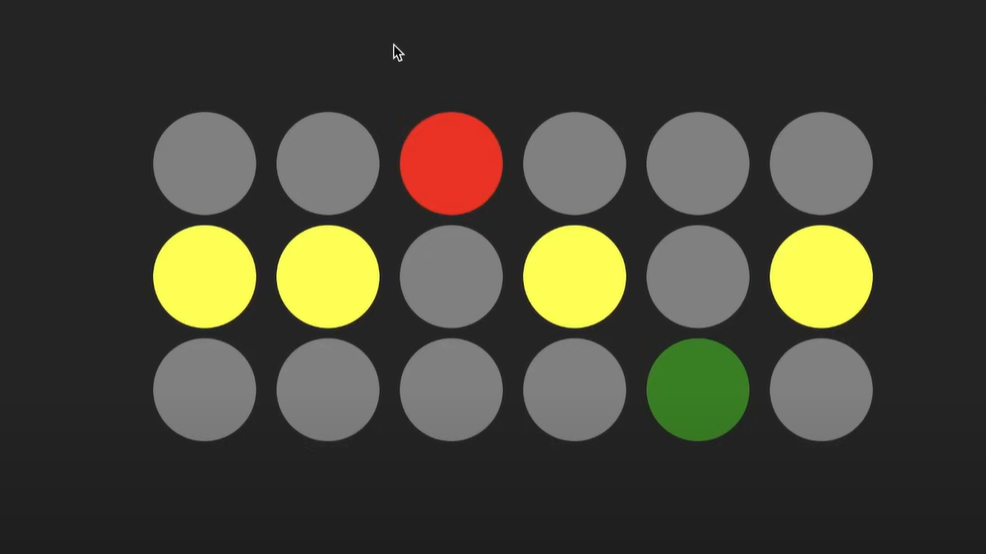

# React Interview Challenge: Stoplight Component

### Objective:

Build a stoplight component in React that switches between different states (red, yellow, green) at specific time intervals.

### Requirements:

1. The component should simulate a traffic light with three states: **Red**, **Yellow**, and **Green**.
2. Each state must be displayed for a specific duration:
   - **Red**: 5 seconds
   - **Yellow**: 2 seconds
   - **Green**: 15 seconds
3. The stoplight should transition automatically between states in a loop.
4. Use React Hooks (such as `useState` and `useEffect`) to manage the component's state and timing logic.

#### Bonus:

- Add a **Start** and **Stop** button to manually control the stoplight transitions.

---

